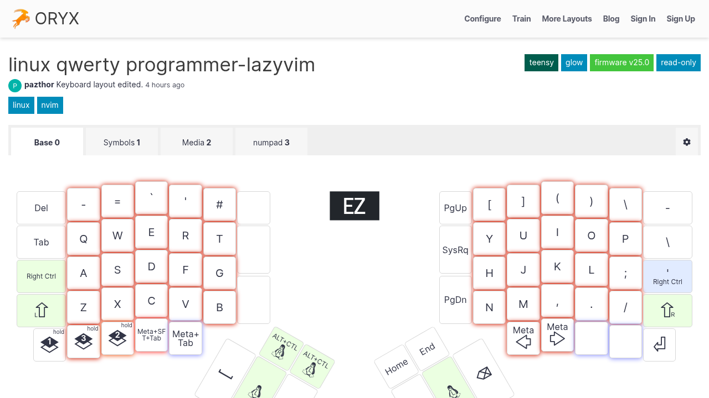
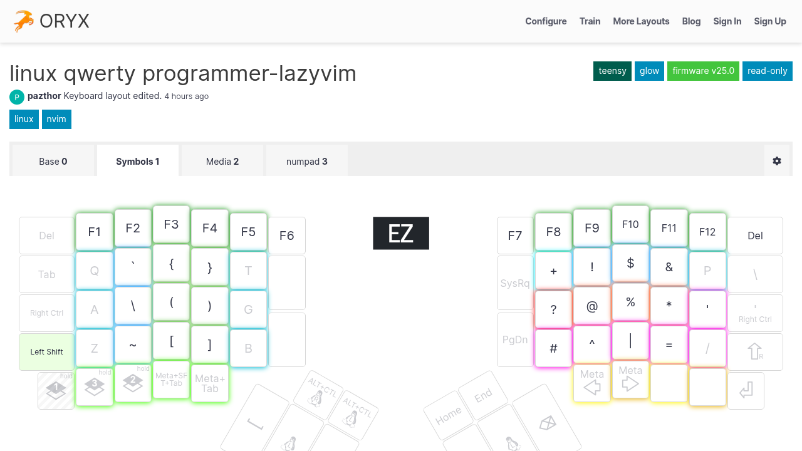
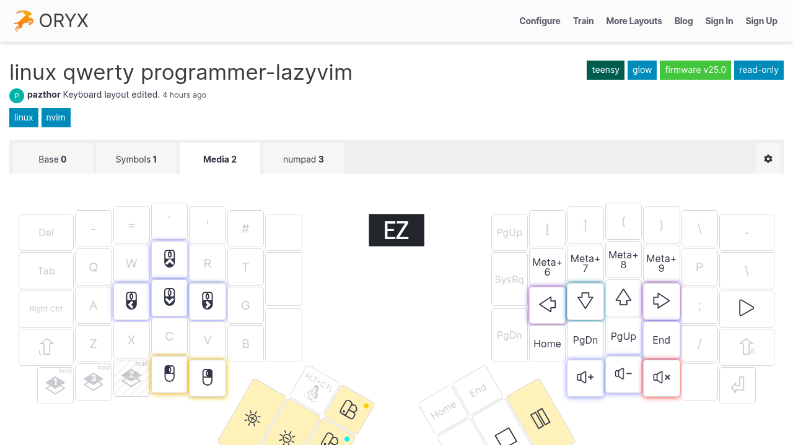
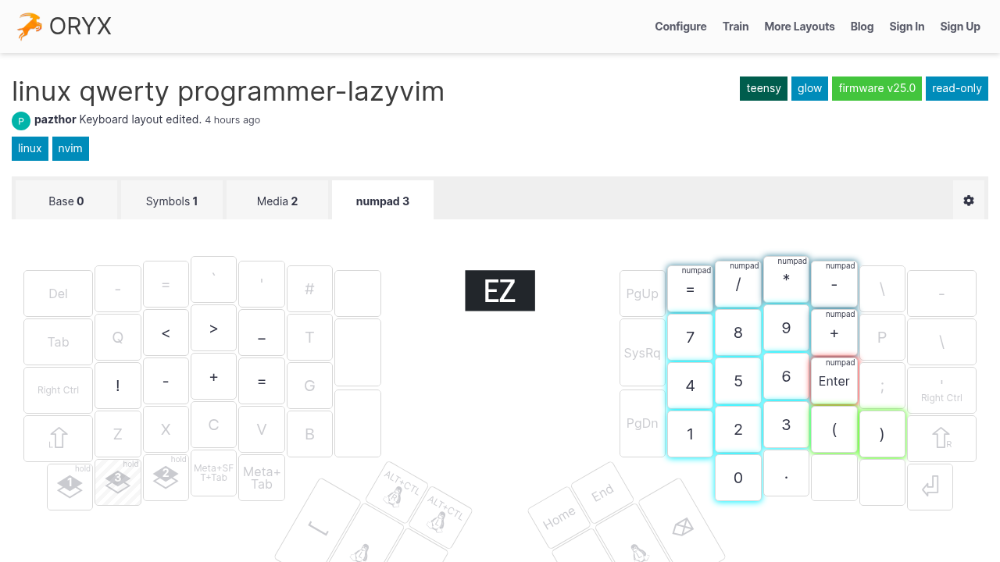

# ErgoDox EZ Firmware — Custom Build

Layout: **linux qwerty programmer-lazyvim** (`6Dvmr/QzpeLD`)  
Keyboard: ErgoDox EZ Glow (Teensy m32u4)  
Firmware branch: ZSA `firmware25`

## What was changed from the Oryx default

- **Base layer (0)**: Number row `1–0` restored. The original Oryx layout had symbols (`- = \` ' # [ ] ( ) \`) on the top row instead.
- **J+K combo → Escape** is preserved (defined in `keymap.c`, enabled via `COMBO_ENABLE = yes` in `rules.mk`).

## Layer maps (from Oryx — reflects original layout, not local changes)

> Note: Screenshots show the Oryx-compiled revision. The number row change only exists in the locally compiled firmware.

**Layer 0 — Base**  


**Layer 1 — Symbols**  


**Layer 2 — Media**  


**Layer 3 — Numpad**  


## Files in this repo

```
config/.config/ergodox/keymap-custom/
  keymap.c      # full layout definition; number row on line 18
  config.h      # TRUE fix for avr-gcc 16, combo count, serial number
  rules.mk      # ORYX_ENABLE, COMBO_ENABLE, LTO_ENABLE
  keymap.json   # module list: zsa/oryx + zsa/defaults

scripts/install/ergodox-build    # build + flash automation
```

## Build & flash

```bash
# First time (clones QMK, modules, LUFA — ~400 MB):
dot install ergodox-build

# Just compile:
dot install ergodox-build

# Compile and flash (keyboard must be plugged in):
dot install ergodox-build --flash
# → when prompted, press the reset button on the keyboard bottom
```

`wally-cli` must be on `$PATH` for `--flash`. It's installed at `/usr/bin/wally-cli`.

## Manual flash (without --flash flag)

```bash
wally-cli ~/qmk_firmware/zsa_ergodox_ez_m32u4_glow_custom.hex
# press reset button when wally-cli says "Waiting for device…"
```

## First-time setup details

The build script handles everything automatically, but here's what it does:

1. Clones `github.com/zsa/qmk_firmware` branch `firmware25` → `~/qmk_firmware`
2. Initialises the LUFA submodule (`lib/lufa`)
3. Clones `github.com/zsa/qmk_modules` and places `oryx` + `defaults` modules under `~/qmk_firmware/modules/zsa/`
4. Applies two avr-gcc 16 compatibility patches:
   - `quantum/send_string/send_string.c`: adds `#include <avr/io.h>` so `TCNT0`/`TCNT1`/`TCNT3`/`TCNT4` resolve
   - `tmk_core/protocol/lufa/lufa.c`: adds `(void)ConfigSuccess;` to suppress `-Werror=unused-but-set-variable`
5. Copies keymap files from `config/.config/ergodox/keymap-custom/` into `~/qmk_firmware/keyboards/zsa/ergodox_ez/m32u4/glow/keymaps/custom/`
6. Runs `qmk compile -kb zsa/ergodox_ez/m32u4/glow -km custom`

## Why not use Oryx directly

The Oryx layout `6Dvmr` has only a compiled revision (`QzpeLD`, `qmkVersion: "25.0"`). The Oryx API marks compiled revisions as read-only (`editable: false`). Writing to it via `saveLayoutSnapshot` returns `NotFound`; `updateKey` returns `Unauthorized`. Local QMK compile is the only path.

## Oryx layout URL

`https://configure.zsa.io/ergodox-ez/layouts/6Dvmr/QzpeLD/0`
